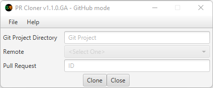
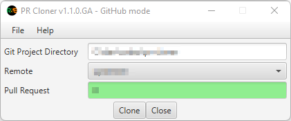

# PR Cloner

A simple tool for cloning git pull request.

## Prerequisite

* Git for Windows
* A git project

## Usage

1. **Navigate** to the **directory** where you've **unzip** the **pr-cloner-desktop-1.2.1-win64.zip file**.

2. Run the **pr-cloner.bat**.

3. **Expect** something like the following window:
   
    

4. Fill-up the **Git Project Directory** field to have the git project.

     > You can **double click** the **Git Project Directory field** to use the **directory explorer** or use the **File -> Git Project Dir** menu.

5. **Expect** to load all the **remotes attached to the git project** in to the dropdown of the **remote field**.

6. **Select** the remote that is **deemed to be the upstream**.

7. On the **pull request field** typed in the **pull request number** from the upstream.

8. Click the **clone button** to clone the pull request.

     > If successful the Pull Request field will turn to green as follows:
     >
     > 

     > If everything is successful, open your **git client** and look for the **local branch name** that has the format **PR<pull request number>**.  You can switch to that branch to review it or do testing on it.

9. Use the **close button** or the **x** at the upper right corner of the window close it.

## Changing the mode

The following are the supported modes:

| Repository Type                           | Mode      |
|-------------------------------------------|-----------|
| GitHub Repository *(This is the default)* | github    |
| Bitbucket Repository                      | bitbucket |

1. **Open** the **directory location** of the **pr-cloner.bat**.

2. **Open** the **conf directory**.

3. Using an editor, **open** the **pr-cloner.properties file**.

4. **Update** the **repoType field** to the appropriate mode. 

   *Opting to use the bitbucket repository update the repoType field to bitbucket like the following:*

   ```properties
   repoType=bitbucket
   ```

5. **Save and Close** the **pr-cloner.properties file**.

## [Changelog](CHANGELOG.md)

## License

This project is licensed under the MIT License - see the [LICENSE.md](LICENSE.md) file for details

